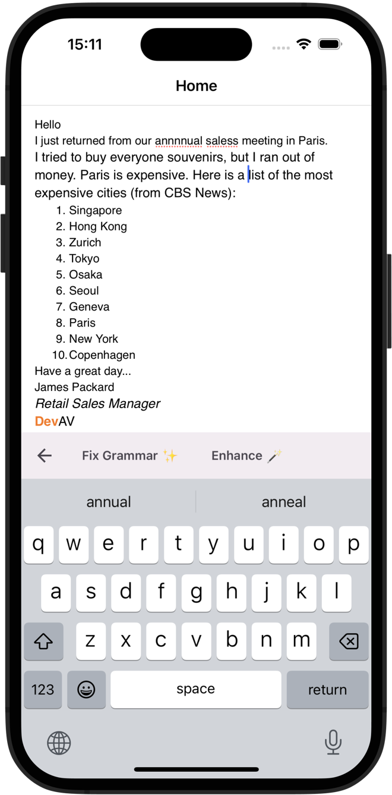

# DevExpress .NET MAUI HTML Edit - Use OpenAI GPT to Improve Text & Grammar

This example uses an Open AI GPT model to check grammar when using the DevExpress HTML Edit control. Note: You must specify your OpenAI API Key in the [MainPage.xaml.cs](MainPage.xaml.cs) file.

Refer to the following blog post for additional information: [.NET MAUI: Check Grammar within the DevExpress HTML Edit Using OpenAI GPT Models](https://community.devexpress.com/blogs/mobile/archive/2024/10/01/net-maui-check-grammar-within-the-devexpress-html-edit-using-openai-gpt-models.aspx).

## Files to Review

- [MainPage.xaml](MainPage.xaml)
- [MainPage.xaml.cs](MainPage.xaml.cs)

## Documentation

- [HTML Edit Overview](https://docs.devexpress.com/MAUI/404635)
- [HTML Edit - Load and Retrieve Content](https://docs.devexpress.com/MAUI/404637/html-edit/load-and-obtain-markup)

## More Examples

* [DevExpress .NET MAUI Demo Center](https://github.com/DevExpress-Examples/maui-demo-app)
* [DevExpress .NET MAUI CRM Demo](https://github.com/DevExpress-Examples/maui-crm-demo)
* [Stocks App](https://github.com/DevExpress-Examples/maui-stocks-mini)
* [Data Grid](https://github.com/DevExpress-Examples/maui-data-grid-get-started)
* [Data Form](https://github.com/DevExpress-Examples/maui-data-form-get-started)
* [Data Editors](https://github.com/DevExpress-Examples/maui-editors-get-started)
* [Charts](https://github.com/DevExpress-Examples/maui-charts)
* [Scheduler](https://github.com/DevExpress-Examples/maui-scheduler-get-started)
* [Tab Page](https://github.com/DevExpress-Examples/maui-tab-page-get-started)
* [Tab View](https://github.com/DevExpress-Examples/maui-tab-view-get-started)
* [Drawer Page](https://github.com/DevExpress-Examples/maui-drawer-page-get-started)
* [Drawer View](https://github.com/DevExpress-Examples/maui-drawer-view-get-started)
* [Collection View](https://github.com/DevExpress-Examples/maui-collection-view-get-started)
* [Popup](https://github.com/DevExpress-Examples/maui-popup-get-started)
