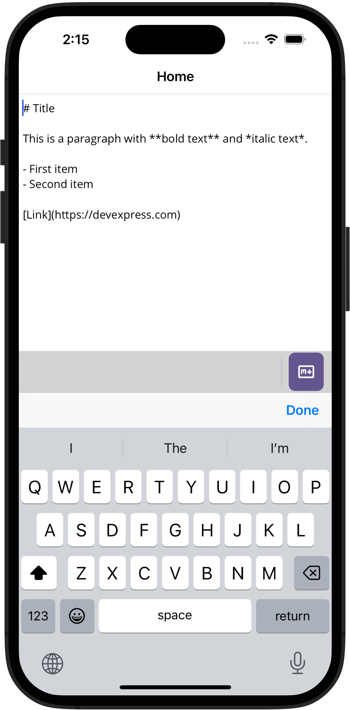

# DevExpress .NET MAUI HTML Edit - Convert HTML to Markdown

This example converts the **HTML Edit** control's content to Markdown.

The example references the [ReverseMarkdown](https://www.nuget.org/packages/ReverseMarkdown) and [MarkedNet](https://www.nuget.org/packages/MarkedNet) packages to convert HTML content to Markdown.

## Files to Review

- [MainPage.xaml](MainPage.xaml)
- [MainPage.xaml.cs](MainPage.xaml.cs)

## Documentation

- [HTML Edit Overview](https://docs.devexpress.com/MAUI/404635)
- [Featured Scenario: Convert HTML to Markdown](https://docs.devexpress.com/MAUI/405019)
- [HTML Edit - Load and Retrieve Content](https://docs.devexpress.com/MAUI/404637/html-edit/load-and-obtain-markup)

## More Examples

* [DevExpress .NET MAUI Demo Center](https://github.com/DevExpress-Examples/maui-demo-app)
* [DevExpress .NET MAUI CRM Demo](https://github.com/DevExpress-Examples/maui-crm-demo)
* [Stocks App](https://github.com/DevExpress-Examples/maui-stocks-mini)
* [Data Grid](https://github.com/DevExpress-Examples/maui-data-grid-get-started)
* [Data Form](https://github.com/DevExpress-Examples/maui-data-form-get-started)
* [Data Editors](https://github.com/DevExpress-Examples/maui-editors-get-started)
* [Charts](https://github.com/DevExpress-Examples/maui-charts)
* [Scheduler](https://github.com/DevExpress-Examples/maui-scheduler-get-started)
* [Tab Page](https://github.com/DevExpress-Examples/maui-tab-page-get-started)
* [Tab View](https://github.com/DevExpress-Examples/maui-tab-view-get-started)
* [Drawer Page](https://github.com/DevExpress-Examples/maui-drawer-page-get-started)
* [Drawer View](https://github.com/DevExpress-Examples/maui-drawer-view-get-started)
* [Collection View](https://github.com/DevExpress-Examples/maui-collection-view-get-started)
* [Popup](https://github.com/DevExpress-Examples/maui-popup-get-started)
